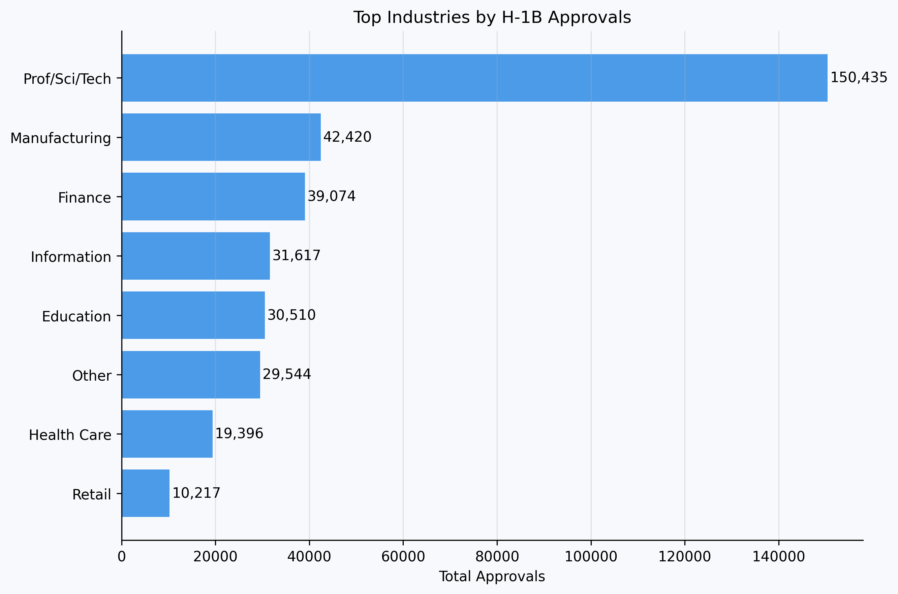
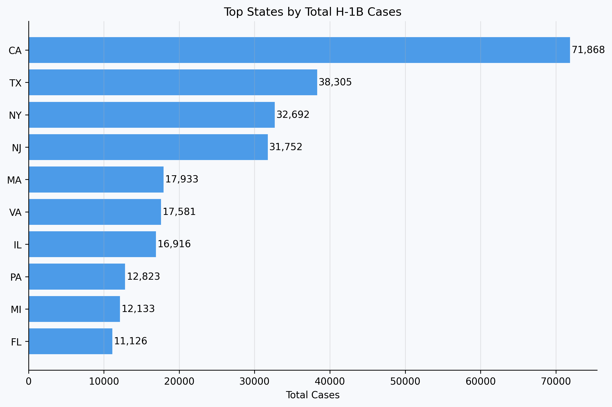
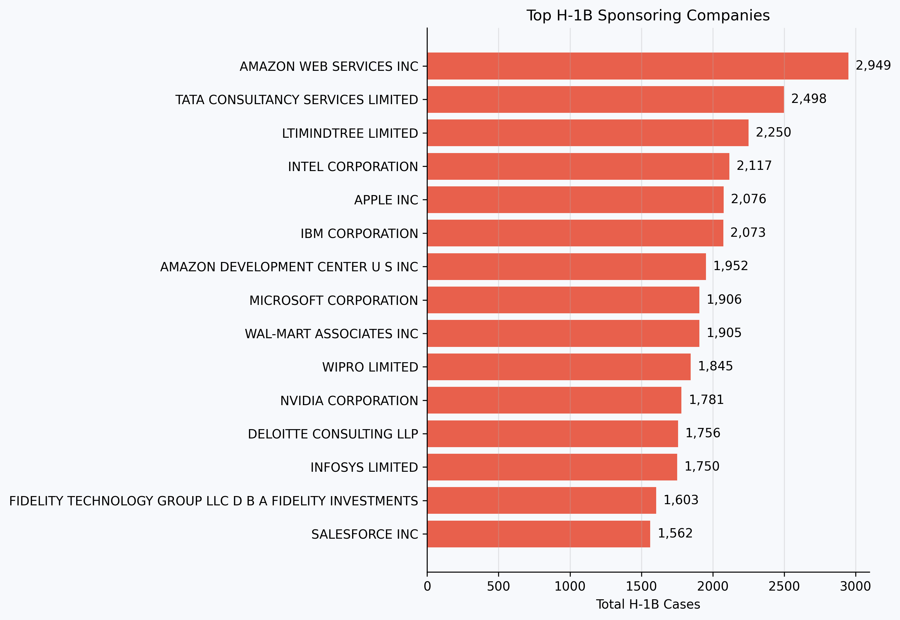
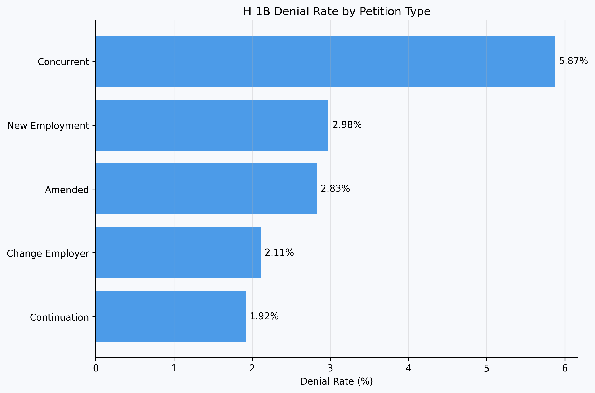

# H-1B Visa Sponsorship Analysis (USCIS Data)

**Author:** Gwan Ho Kong  
**Project Type:** Exploratory Data Analysis (EDA)  
**Dataset Source:** USCIS H-1B Employer Data Hub  

https://www.uscis.gov/tools/reports-and-studies/h-1b-employer-data-hub

---

# Project Overview

This project analyzes patterns in **H-1B visa sponsorship and approval outcomes** using employer-level data from the **USCIS H-1B Employer Data Hub**.

The goal of this analysis is to explore how H-1B petitions vary across:

- Companies
- Industries
- Geographic regions
- Petition types

The dataset used in this analysis is the **FY2025 Employer Information dataset**, which contains approximately **62,000 employer-level records**.

---

# Research Questions

This exploratory analysis focuses on the following questions:

- Which companies sponsor the most H-1B workers?
- Which industries receive the highest number of H-1B approvals?
- Which U.S. states have the largest number of H-1B cases?
- How do denial rates differ across petition types?

---

# Key Visualizations

## Top Industries by H-1B Approvals

Industries related to **professional, scientific, and technical services** dominate H-1B approvals, highlighting the strong demand for specialized technical talent.

---

## Top States by Total H-1B Cases

States with major technology hubs, such as **California and Texas**, account for a large share of H-1B petitions.

---

## Top H-1B Sponsoring Companies

A relatively small number of large companies sponsor a significant portion of H-1B workers.

Many of these employers are large technology firms or consulting companies.

---

## H-1B Denial Rate by Petition Type

Denial rates vary slightly across petition types but remain relatively low overall, generally below **6%**.

---

# Dataset

**Source:** USCIS H-1B Employer Data Hub

https://www.uscis.gov/tools/reports-and-studies/h-1b-employer-data-hub

The dataset includes employer-level information about H-1B petitions, including:

- Employer (Petitioner) Name
- Industry (NAICS Code)
- Petitioner City / State
- Petition approvals and denials by type
- Fiscal year

The **FY2025 dataset contains approximately 62,000 rows**.

---

# Tools Used

The analysis was conducted using the following tools:

- Python
- Pandas
- Matplotlib
- Seaborn
- Jupyter Notebook

---

# Repository Structure
h1b-visa-analysis
│
├── data
│ └── Employer_Information_2025.csv
│
├── notebooks
│ └── h1b_analysis.ipynb
│
├── figures
│ ├── top_industries.png
│ ├── top_states.png
│ ├── top_employers.png
│ └── denial_rates.png
│
└── README.md

---

# Future Work

Future work for this project may include:

- Hypothesis testing on approval rate differences across industries
- Geographic visualization of H-1B cases using state-level maps
- Feature engineering for machine learning analysis
- Predictive modeling of H-1B petition outcomes

---

# Author

**Gwan Ho Kong**
UC Berkeley
